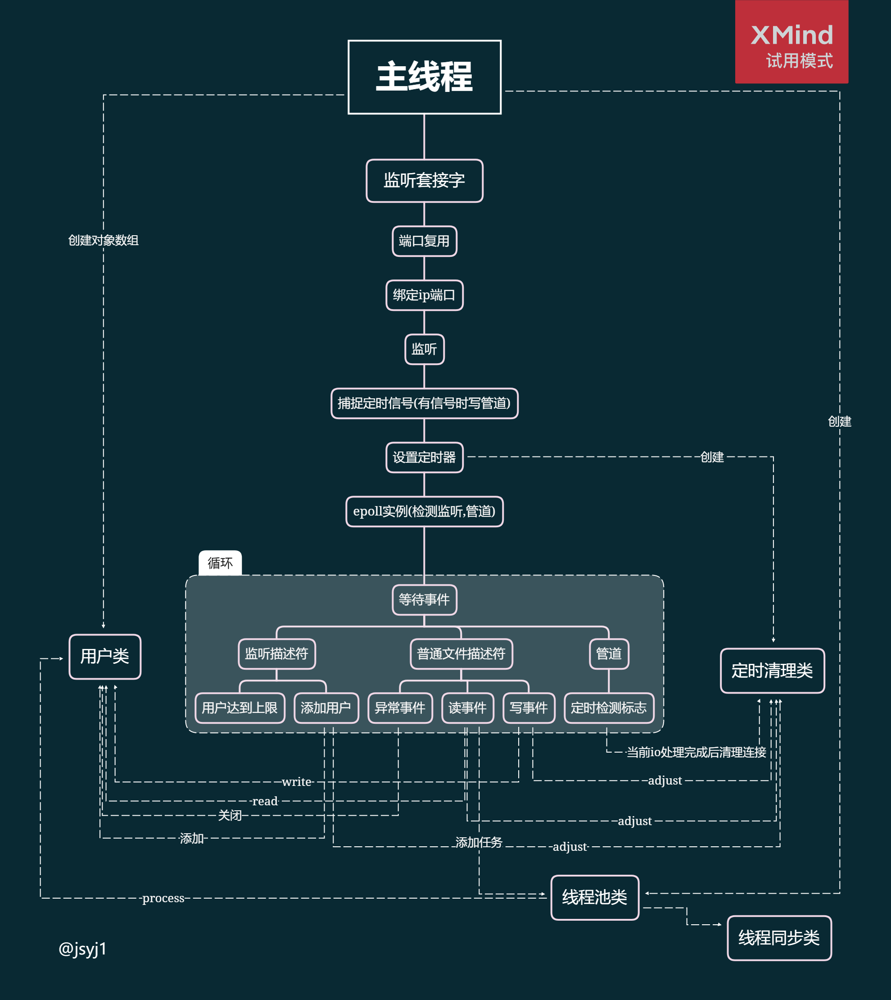

# webserver

---
**伪proactor(主线程读写)+ET模式**




---

`使用方法:`

```
cd webserver/build
./main 端口号
```

---

待完善: 
* http请求解析与响应未完善，任何请求均对应ok
* 日志系统


目前有打印出请求资源信息，若想要进一步提升性能，可以在程序中注释掉所有cout...

---
参考

* [linux高并发服务器开发](https://www.nowcoder.com/study/live/504)
* [TinyWebServer](https://github.com/qinguoyi/TinyWebServer)

